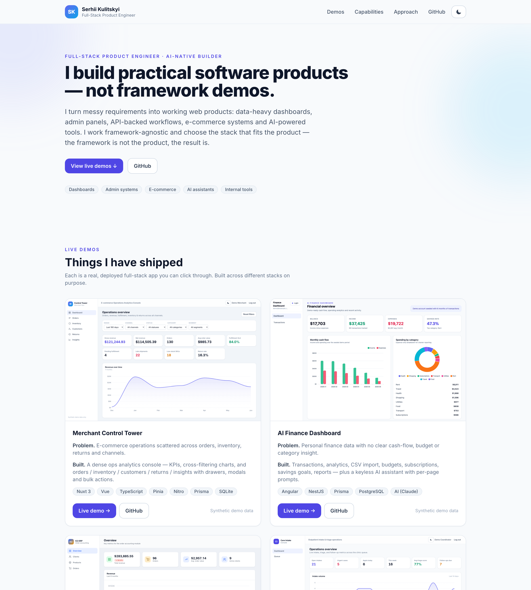
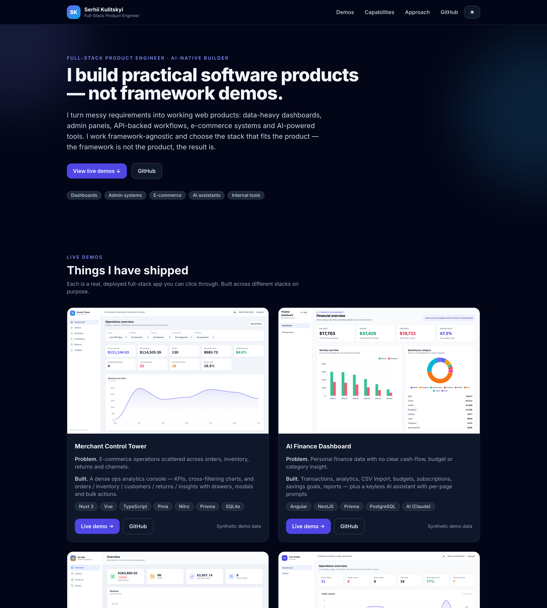
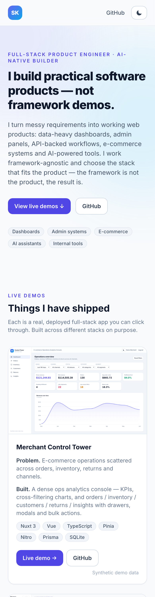

# k1ngp1n.com — Personal Portfolio

Personal landing / portfolio for **Serhii Kulitskyi** — a framework-agnostic full-stack
product engineer and AI-native builder.

Live site: https://k1ngp1n.com

The portfolio is intentionally not positioned as a single-framework resume. It highlights
practical products across React/Next, Vue/Nuxt, Angular, Flask, NestJS, Prisma, PostgreSQL,
SQLite, WebGL, maps, and AI-assisted workflows.

## Live demos

All demos use synthetic data. No real customer, patient, finance, order, or operational data
is included.

| Demo | URL | Repo |
|---|---|---|
| Merchant Control Tower | https://merchant.k1ngp1n.com | https://github.com/K1ngp1nDev/merchant-control-tower |
| SWITCHBOARD — AI Agent Control Room | https://switchboard.k1ngp1n.com | https://github.com/K1ngp1nDev/switchboard |
| RESONANCE LAB | https://resonance.k1ngp1n.com | https://github.com/K1ngp1nDev/resonance-lab |
| LINEHAUL — Fleet Operations Console | https://linehaul.k1ngp1n.com | https://github.com/K1ngp1nDev/linehaul |
| Aura Commerce Configurator | https://commerce.k1ngp1n.com | https://github.com/K1ngp1nDev/commerce-configurator |
| AI Finance Dashboard | https://finance.k1ngp1n.com | https://github.com/K1ngp1nDev/finance-dashboard-frontend |
| K2 CRM / ERP — Order Accounting | https://crm.k1ngp1n.com | https://github.com/K1ngp1nDev/k2-crm |
| Care Intake Console | https://care.k1ngp1n.com | https://github.com/K1ngp1nDev/care-intake-console-web |

## Screenshots



<table>
  <tr>
    <td width="50%"></td>
    <td width="50%"></td>
  </tr>
</table>

## Site stack

- **Nuxt 3** + **Vue 3** + **TypeScript**
- **Tailwind CSS** + **@nuxtjs/color-mode**
- SSR/prerendered root page for SEO
- Static project data and thumbnail assets
- Docker-ready Nitro server

Nuxt is the tool used for this portfolio shell. The project demos intentionally cover a wider
set of stacks and product surfaces.

## Local development

```bash
npm install
npm run dev
```

Default local URL:

```text
http://localhost:3000
```

## Production build

```bash
npm run build
node .output/server/index.mjs
```

The Nitro server reads `PORT` from the environment. Default is `3000`.

## Docker

```bash
docker build -t k1ngp1n-portfolio .
docker run -d --name k1ngp1n-portfolio -p 3000:3000 k1ngp1n-portfolio
```

## VPS deployment notes

The live deployment runs as Docker containers behind Caddy. The root site and demo apps are
separate services, each exposed by its own subdomain.

Example Caddy routing shape:

```caddy
k1ngp1n.com, www.k1ngp1n.com {
    encode zstd gzip
    reverse_proxy k1ngp1n-portfolio:3000
}

merchant.k1ngp1n.com {
    encode zstd gzip
    reverse_proxy k1ngp1n-merchant:3000
}

commerce.k1ngp1n.com {
    encode zstd gzip
    reverse_proxy k1ngp1n-commerce:3000
}

finance.k1ngp1n.com {
    encode zstd gzip
    reverse_proxy k1ngp1n-finance-frontend:80
}

crm.k1ngp1n.com {
    encode zstd gzip
    reverse_proxy k1ngp1n-k2-crm:5000
}

care.k1ngp1n.com {
    encode zstd gzip
    reverse_proxy k1ngp1n-care-web:80
}

linehaul.k1ngp1n.com {
    encode zstd gzip
    reverse_proxy k1ngp1n-linehaul:80
}

resonance.k1ngp1n.com {
    encode zstd gzip
    reverse_proxy k1ngp1n-resonance:80
}

switchboard.k1ngp1n.com {
    encode zstd gzip
    reverse_proxy k1ngp1n-switchboard:80
}
```

DNS is managed in Cloudflare. Each root/subdomain record points to the same VPS and is proxied
through Cloudflare.

## Screenshot limits

Screenshots used for portfolio cards and Upwork assets should stay within `4000x4000`.

```bash
node docs/check-screenshots.mjs
```
